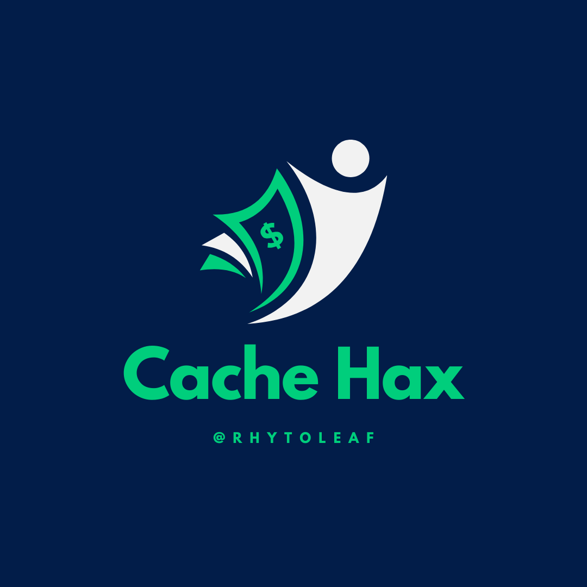

# CacheHax

CacheHax is an innovative financial evaluation app that empowers users to assess their financial health against key benchmarks. Your financial Zenith awaits you!

### DISCLAIMER: 

Please be aware that financial markets and regulations can change rapidly, and the information provided may become outdated. It is your responsibility to verify and update any information before making financial decisions.

By engaging in any discussion or receiving information from me, you acknowledge and agree to these terms and release me from any and all liability, claims, or damages arising from or in connection with the use of the information provided.

If you require personalized financial advice, it is strongly advised to consult with a qualified financial professional who can assess your individual situation and provide appropriate guidance.

## Features

- **Benchmark Analysis**: Easily compare your financial data against industry benchmarks.
- **Budget Tracking**: Keep tabs on your expenses and income to make informed financial decisions.
- **Financial Goals**: Set and track your financial goals with precision.
- **User-Friendly Interface**: Intuitive design for a seamless user experience.
- **Secure**: Your financial data is kept safe and confidential.

## Usage

1. Enter profit (daily / Monthly / yearly)
2. Explore our proposed benchmark
*NOTE: Guilt-free pleasure category is the most overlooked*

## Technologies Used

- **Frontend**: HTML, CSS, JavaScript
- **Backend**: Python, Flask
- **Database**: PostgreSQL

## Contributing

We welcome contributions from the community. Feel free to submit bug reports, feature requests, or even pull requests to improve CacheHax.

## Support

If you encounter any issues or have questions, please reach out to our support team at support@cachehax.com.

## License

This project is licensed under the [MIT License](RhytoLeaf 2023).

## Acknowledgments

We would like to express our gratitude to the open-source community for their invaluable contributions and inspiration.

---

Your financial Zenith is just a few clicks away. Start evaluating and optimizing your finances with CacheHax today!